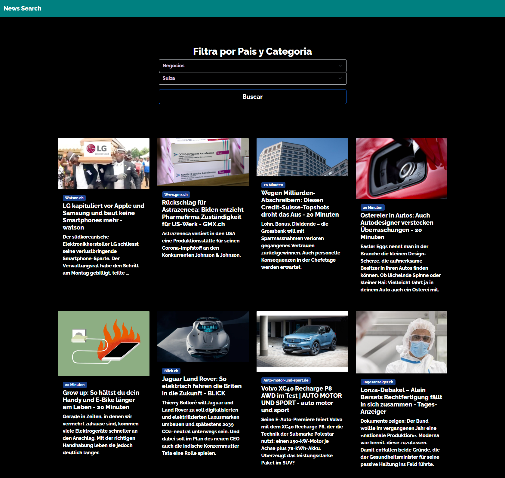

# Noticias
## Angular 11 y Bootstrap 5 - 
### En La cabezera con el sistema de busqueda sigo el ejemplo de  https://getbootstrap.com/docs/5.0/examples/album/ 
## El thema de bootstrap 
 El tema lo hago con bootstrap5 modificando lo siguiente:
* navbar.components.css 
```
*{
    background-color: teal !important;
    color:whitesmoke;
}
```
* formulario.components.css 
```
select{
        color:whitesmoke;
}
```
* styles.css 
```
* {
        background-color: black !important;

    color:white;
    font-family: 'Raleway', sans-serif;
}

.bg-primary{
    background-color: rgb(23, 61, 133) !important;
}
```

 


This project was generated with [Angular CLI](https://github.com/angular/angular-cli) version 11.0.1.

## Development server

Run `ng serve` for a dev server. Navigate to `http://localhost:4200/`. The app will automatically reload if you change any of the source files.

## Code scaffolding

Run `ng generate component component-name` to generate a new component. You can also use `ng generate directive|pipe|service|class|guard|interface|enum|module`.

## Build

Run `ng build` to build the project. The build artifacts will be stored in the `dist/` directory. Use the `--prod` flag for a production build.

## Running unit tests

Run `ng test` to execute the unit tests via [Karma](https://karma-runner.github.io).

## Running end-to-end tests

Run `ng e2e` to execute the end-to-end tests via [Protractor](http://www.protractortest.org/).

## Further help

To get more help on the Angular CLI use `ng help` or go check out the [Angular CLI Overview and Command Reference](https://angular.io/cli) page.
